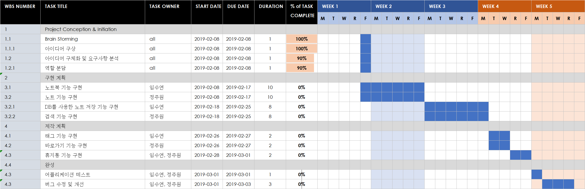

# 안드로이드 프로젝트

## 1 프로젝트 개요

```
- 기존의 메모장 어플리케이션을 모티브로 삼아 불필요한 기능은 없애고, 필요한 기능을 추가한 새로운 메모장 어플리케이션을 개발한다.
```
---

## 2 프로젝트 명 및 기간

- 프로젝트 명 : 네버노트 프로젝트
- 프로젝트 기간 : 2019.02.08 ~ 2019.03.04(25일)
- 프로젝트 인원 : 2명
    - 임수연 : 프로젝트 매니저, 기획자, 개발자
    - 정주원 : 기획자, 개발자

---

## 2.1 프로젝트 목표
외부 목표 : 기존의 메모장 어플에서 주요기능만을 남긴 최적화된 메모장 어플리케이션을 만든다.

내부목표 
- 임수연 : 안드로이드 개발 경험을 쌓고 자바 언어 사용의 숙련도를 높인다.
- 정주원 : 

---

## 3. 프로젝트 상세 내용

### 3.1 요구사항 분석 


### 3.2 구현 계획

#### 3.2.1 역할 분담
- 임수연 : 노트북, 메뉴, 태그 기능 구현
- 정주원 : 노트, 검색, 바로가기 기능 구현

#### 3.2.2 구현 일정
WBS



### 3.3 테스트 계획
```
노트북 생성, 노트 입력, 검색, 태그 검색의 기능이 작동하는지 시험
```

## 4. 프로젝트 관리
```
github를 사용하여 코드를 공유하고 버전관리 및 이슈관리를 한다.